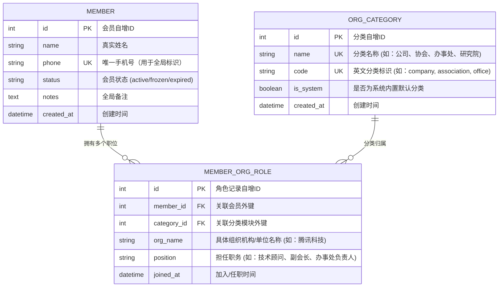

# 👥 EMIS 会员管理系统 - “身兼多职”与“自定义分类模块”扩展方案

本设计方案旨在升级现有的单一“会员-所属单位”扁平模型，全面重构为**“多对多（M2M）角色关联模型”**。同时支持**自定义组织机构分类**，使用户能够自由开辟“公司”、“协会”、“办事处”等分类模块。通过先进的架构重构，不仅能够让搜索一个人名回显他在所有单位担任的所有职务，还能实现分模块多维度的高效聚合管理。

---

## 🏗️ 核心数据库建模升级 (Database Schema Design)

为了支持“一人身兼多职”及“自定义组织分类模块”，我们将数据库结构重构如下：



### 1. 会员主表 (`users_member`)
保留会员的基本物理人属性，将特定单位属性抽离：
*   `id`: 整数，主键
*   `name`: 字符串(50)，姓名
*   `phone`: 字符串(20)，手机号（设定为唯一，防止因重复导入导致多角色冲突）
*   `status`: 字符串(20)，状态
*   `notes`: 文本，备注

### 2. 组织机构分类定义表 (`users_org_category` - 新增)
用于支持用户**自定义创建分类模块**（如公司、协会、办事处等）：
*   `id`: 整数，主键
*   `name`: 字符串(50)，唯一，分类展示名称（如 `"公司"`、`"协会"`、`"办事处"`）
*   `code`: 字符串(50)，唯一，系统编码（如 `"company"`、`"association"`、`"office"`）
*   `is_system`: 布尔型，是否为系统预置，预置分类不允许删除。

### 3. 会员-组织职位关联关系表 (`users_member_org_role` - 新增)
核心关系表，支撑**一人身兼多职**：
*   `id`: 整数，主键
*   `member_id`: 整数，外键，关联会员主表 (`users_member`)，级联删除
*   `category_id`: 整数，外键，关联分类表 (`users_org_category`)
*   `org_name`: 字符串(200)，组织单位名称
*   `position`: 字符串(100)，担任职务 (如：`"技术顾问"`、`"副会长"`)
*   `joined_at`: 日期时间，加入任职时间

---

## 📡 REST API 接口演进设计 (API Endpoints & Serialization)

### 1. 会员信息接口序列化器 (Serializer)
在获取会员列表或进行人名检索时，通过嵌套序列化器将该会员关联的所有职位一次性完整输出：

```json
{
  "id": 12,
  "name": "张三",
  "phone": "13800001234",
  "status": "active",
  "status_display": "正常",
  "notes": "资深标准化技术专家",
  "roles": [
    {
      "id": 101,
      "category_name": "公司",
      "category_code": "company",
      "org_name": "腾讯科技(深圳)有限公司",
      "position": "首席标准化架构师"
    },
    {
      "id": 102,
      "category_name": "协会",
      "category_code": "association",
      "org_name": "深圳市软件行业协会",
      "position": "副会长"
    },
    {
      "id": 103,
      "category_name": "办事处",
      "category_code": "office",
      "org_name": "EMIS北京联络处",
      "position": "办事处负责人"
    }
  ],
  "created_at": "2026-05-18 10:00:00"
}
```

### 2. 人名/多职位模糊检索逻辑
当在前端会员后台搜索框中输入 `"张三"` 进行搜索时，后端不仅匹配会员姓名，还支持联级过滤：
*   **查询 SQL / Django ORM 逻辑**：
    ```python
    # 模糊检索：匹配人名，或匹配其名下任意一个任职单位、职务
    qs = Member.objects.prefetch_related('roles__category')
    if keyword:
        qs = qs.filter(
            Q(name__icontains=keyword) |
            Q(phone__icontains=keyword) |
            Q(roles__org_name__icontains=keyword) |
            Q(roles__position__icontains=keyword)
        ).distinct()
    ```

---

## 🖥️ 前端高级 CRM 交互形态设计 (Frontend UI/UX)

### 1. 会员列表展示：“折叠卡片”或“多徽章聚合”
*   在前端的会员管理列表中，原先的“所属单位”单列将被改造为**“多职任职链”**展示列。
*   每个会员行下方或卡片内，会以 **Tag (徽章标签)** 的形式显示其职位：
    *   🏢 `公司` **腾讯科技** ｜ *技术顾问*
    *   🤝 `协会` **软件行业协会** ｜ *副会长*
    *   📍 `办事处` **北京联络处** ｜ *负责人*
*   点击某一行可展开其多职详情。

### 2. 反向分类模块页导航：“动态 Tabs 标签页”
会员管理后台顶部将渲染一组**动态 Tabs (标签页)**。这组标签页由数据库中的 `OrganizationCategory` 表动态渲染：

```
+-----------------------------------------------------------------------------------+
|  [ 全部会员 ]   [ 🏢 公司 ]   [ 🤝 协会 ]   [ 📍 办事处 ]   [ ➕ 自定义分类模块 ]  |
+-----------------------------------------------------------------------------------+
|  分类名称: 协会会员                                                               |
|  说明: 当前展示所有在“协会”组织中担任职务的会员列表。                             |
|                                                                                   |
|  +--------+------------+--------------------+----------+-----------------------+  |
|  | 姓名   | 手机号     | 关联协会机构       | 担任职务 | 操作                  |  |
|  +--------+------------+--------------------+----------+-----------------------+  |
|  | 张三   | 13800001234| 深圳市软件行业协会  | 副会长   | [编辑职务] [移除]     |  |
|  | 李四   | 13900005678| 中国标准化协会     | 理事     | [编辑职务] [移除]     |  |
|  +--------+------------+--------------------+----------+-----------------------+  |
+-----------------------------------------------------------------------------------+
```

*   **添加分类模块**：用户可以点击 `"➕ 自定义分类模块"` 按钮，弹出一个轻量级的 Modal 对话框，输入如 `"研究院"` 或 `"产业联盟"`，系统便会动态在数据库中增加一个分类记录，并在顶部 Tabs 中实时渲染出来！
*   **分流查看**：用户切换到 `“协会”` 标签，表格便会立即调用 `/api/client/members/?category_code=association` 接口，仅列出在协会任职的会员；切换到 `“办事处”` 同理。

### 3. 会员创建/编辑：“一键多职动态表单”
*   在新增/修改会员的 Drawer 或 Modal 弹窗中，提供 **“动态表单项 (Dynamic Form List)”** 交互：
    *   提供主信息输入（姓名、手机号、全局备注）。
    *   提供“新增任职记录”按钮，点击后动态增加一行：
        *   `[分类下拉选择 (公司/协会/办事处/新分类)]` — `[单位/机构名称输入框]` — `[职务/角色输入框]` — `[❌ 移除]`
    *   用户可以一次性为这名会员添加 3 个不同的职务，保存时一次提交，接口自动处理 `Member` 与 `MemberOrgRole` 的增删改。

---

## 🛠️ 分阶段开发实施计划

### 阶段一：后端数据库迁移与接口重构 (预计 0.5 天)
1. 在 `users/models.py` 中新增 `OrganizationCategory` 和 `MemberOrgRole` 模型，创建数据表迁移。
2. 编写初始化脚本，自动将现有的 `Member.company` 单一字符串转换为首条默认任职关联数据，保障历史数据不丢失。
3. 升级 `MemberSerializer`，支持 roles 联表嵌套序列化，重构 List/Retrieve/Create 视图支持多职位联合检索。

### 阶段二：自定义分类模块增删改接口 (预计 0.2 天)
1. 编写 `OrganizationCategoryViewSet` 接口，支持分类模块的增删改查。

### 阶段三：前端 CRM 身兼多职动态表单与 Tabs 标签页重构 (预计 0.8 天)
1. 在会员管理页面顶部实现动态获取分类列表并渲染为 Antd Tabs 切换卡。
2. 重构会员 Table，实现多职务 Tags 水平聚合排列、人名多角色穿透检索。
3. 实现新增会员 Drawer 下的动态职位表单项组件，支持一键增删多职位。

---

请您审阅此方案！如果您觉得整体流程设计和您的要求完全契合，**请告诉我，我将为您立刻着手代码重构！**
