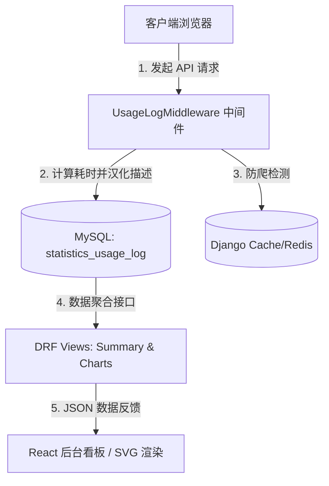

# 用户使用情况记录与活跃监控模块 — 说明文档

本模块为 **企业管理信息系统 (EMIS)** 新增的独立功能模块，专门用于监控用户活跃量与活跃率，捕获前台检索热点，并提供恶性高频下载防刷屏的安全审计支持。

---

## 1. 系统架构设计

模块设计高度遵循 **“高内聚低耦合”** 和 **“代码分明”** 的工程纪律，前后端逻辑完全独立并模块化。



---

## 2. 后端设计说明 (Django App: `statistics`)

### 2.1 数据库结构 (`statistics_usage_log`)
保存每一次请求的属性与操作细节：

- **user** (ForeignKey): 操作用户的系统账户关联（未登录则为空）。
- **username / real_name**: 操作用户当时注册的用户名及真实姓名备份（冗余字段，保障用户账号注销后操作审计记录依然有效）。
- **ip_address**: 客户端 IPv4/IPv6 真实网络地址。
- **action**: 核心请求对应的中文描述（如：前台检索企业、前台预览企标PDF 等）。
- **keyword**: 用户搜索时输入的关键词（用于热词观察统计）。
- **target_id**: 操作目标的 ID（如企标的记录 ID、企业的记录 ID 等）。
- **duration**: 数据库及服务端的响应总耗时（秒）。
- **is_warning**: 安全预警标记（10分钟内预览/下载企标数超过 15 次，触发异常爬取预警）。

### 2.2 请求拦截逻辑 (`statistics.middleware.UsageLogMiddleware`)
1. **自动拦截**：通过 Django Middleware 中间件机制，只过滤 `/api/` 路径下的业务接口。
2. **异步健壮性**：日志写入采用 `try-except` 包裹，保障主业务（如标准下载、数据检索等）不受日志层影响。
3. **用户追溯**：对于因早期过滤器挂起的请求或报错请求，自动解析客户端 HTTP 头中的 `Bearer Token`，精确抓取操作账户。

---

## 3. 前端设计说明 (React + Ant Design)

页面组件独立开发于 [src/pages/Admin/Statistics](file:///e:/企标管理系统_企标记录/emis/frontend/src/pages/Admin/Statistics) 目录下，各负其责，方便代码迭代：

1. **`index.tsx` (入口组合)**
   负责加载状态处理、调用 TanStack Query 钩子并完成各大子模块的布局组合。
2. **`components/StatsCards.tsx` (概览指标卡)**
   使用 Card & Statistic 组件，并配以 Tooltip，宏观反馈系统累计使用量、日活跃度量、DAU 日活跃率（以及 WAU 周活跃率）。
3. **`components/TrendLineChart.tsx` (活跃量趋势折线图)**
   纯原生响应式 SVG 折线图，展示过去 15 天内系统的日使用频次波动。
4. **`components/UserBarChart.tsx` (活跃用户柱状图)**
   纯原生 SVG 水平条形图，自动按点击量高低排行前 8 位最活跃的用户，前 3 名配以专属荣誉奖牌。
5. **`components/TimeDistributionChart.tsx` (时段活跃柱状图)**
   24小时纵向柱状图，反应每日系统使用的高峰时段与低谷时段。
6. **`components/KeywordsAndStandards.tsx` (热点关注分析)**
   - **用户检索热词榜**：以不同层级的进度条反馈用户最经常搜索的企业或领域名词。
   - **受关注企标 Top 5**：追踪点击、下载频率最高的前5份企业标准名称。
7. **`components/LogsTable.tsx` (明细审计表格)**
   - 支持后端分页、状态码着色渲染。
   - 提供按操作人、类型、IP、起止日期和警报等级的一键过滤，并且高频爬取记录采用呼吸红色标签预警。

---

## 4. 验证与维护

- **测试套件运行**：
  在 `emis/backend` 目录下执行如下命令可进行自动化功能测试：
  ```powershell
  python manage.py test statistics
  ```
- **生产构建打包**：
  在 `emis/frontend` 目录下执行如下命令可进行编译与 TypeScript 检查：
  ```powershell
  npm run build
  ```
